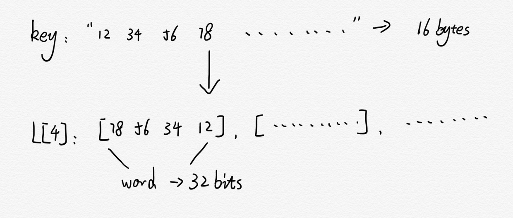
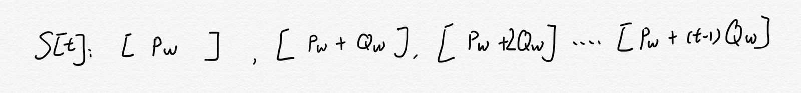
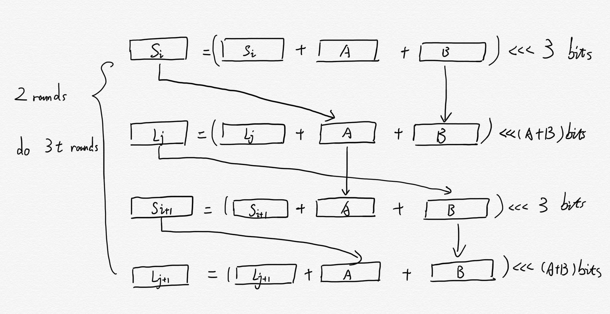
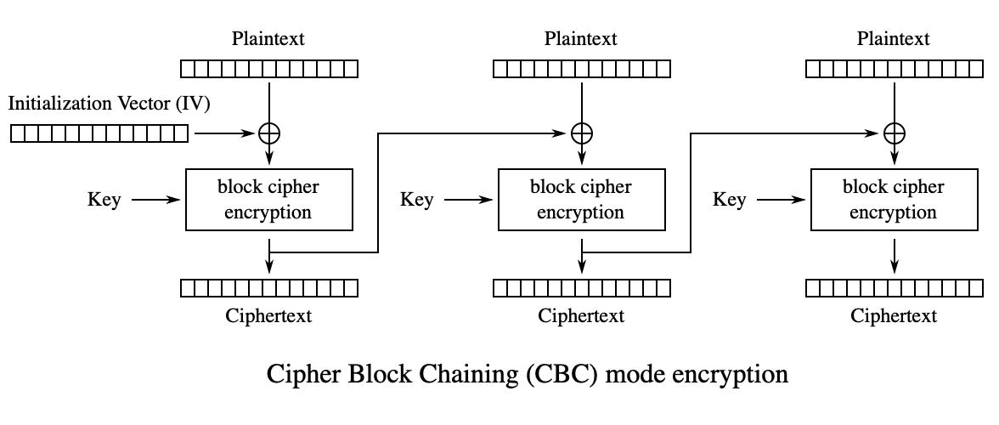
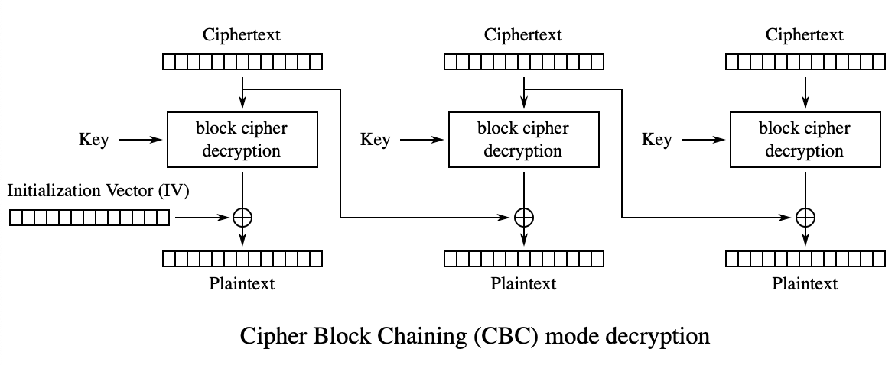

# Go-RC5-32/12/16

RC5 is a symetric-key block cipher designed in 1994. The RC5 is basically denoted as RC5-w/r/b where w=word size in bits, r=number of rounds, b=number of 8-bit bytes in the key. My implementation would be RC5-32/12/16

The encryption and decryption routines can be specified in a few lines of code. The key schedule, however, is more complex, expanding the key using an essentially one-way function with the binary expansions of both e and the golden ratio.

## Algorithm

### Key Expansion
RC5 encryption and decryption both expand the random key into 2(r+1) words that will be used sequentially (and only once each) during the encryption and decryption processes.

#### Step-1: Convert secret key from bytes to words
This step converts the b-byte (b=number of 8-bit bytes in the key) key into a sequence of words stored in the array L.
```
for(i = b-1, L[c-1] = 0; i != -1; i--)
   L[i/u] = (L[i/u] << 8) + K[i];
```
> u = w / 8



#### Step-2: Initialize the expanded key table
This step fills in the S table with magic constant Pw and Qw.
* For w = 16: Pw = 0xB7E1, Qw = 0x9E37
* For w = 32: Pw = 0xB7E15163, Qw = 0x9E3779B9
* For w = 64: Pw = 0xB7E151628AED2A6B, Qw = 0x9E3779B97F4A7C15
```
for(S[0] = Pw, i = 1; i < t; i++)
   S[i] = S[i-1] + Qw;
```
> t = 2 * (r+1)



#### Step-3: Mix in the secret key
This step is mixing secret key L with key table S
```
A = B = i = j = 0
for(k = 0; k < 3 * t; k++)
{
   A = S[i] = ROTL(S[i] + (A + B), 3);
   B = L[j] = ROTL(L[j] + (A + B), (A + B));
   i = (i+1) % t
   j = (j+1) % c
}
```
> t = 2 * (r+1), c = number words in key = ceil(8 * b / w)



### Encryption
#### Step-1: Load A and B values
This step converts input bytes into two unsigned integers called A and B.  When value w of RC5 is 32, A and B are 32 bit values. The first input byte becomes the least significant byte of A, the fourth input byte becomes the most significant byte of A, the fifth input byte becomes the least significant byte of B and the last input byte becomes the most significant byte of B.
```
RC5_WORD    A, B;
A  =  in[0] & 0xFF;
A += (in[1] & 0xFF) << 8;
A += (in[2] & 0xFF) << 16;
A += (in[3] & 0xFF) << 24;
B  =  in[4] & 0xFF;
B += (in[5] & 0xFF) << 8;
B += (in[6] & 0xFF) << 16;
B += (in[7] & 0xFF) << 24;
```

#### Step-2: Iterating the round function
This step mixes the expanded key with the input to perform the fundamental encryption operation.  The first two words of the expanded key are added to A and B respectively and then the round function is repeated r times.
```
A = A + S[0];
B = B + S[1];
for (i = 1 ; i <= R ; i++) {
   A = A ^ B;
   A = ROTL(A, B, W) + S[2*i];
   B = B ^ A;
   B = ROTL(B, A, W) + S[(2*i)+1];
}
```

#### Step-3: Storing the A and B values
The final step is to convert A and B back into a sequence of bytes. This is the inverse of the load operation.
```
out[0] = (A >>  0) & 0xFF;
out[1] = (A >>  8) & 0xFF;
out[2] = (A >> 16) & 0xFF;
out[3] = (A >> 24) & 0xFF;
out[4] = (B >>  0) & 0xFF;
out[5] = (B >>  8) & 0xFF;
out[6] = (B >>  16) & 0xFF;
out[7] = (B >>  24) & 0xFF;
```

### Decryption
Since this is the symetric encryption, the decryption is the inverse of the encrypt operation.


## Supporting CBC (Cipher Block Chaining) mode
```
type cipher32 struct {
	S      [t]uint32 //The round subkey words that used in each round
	Mode   int       // indicate mode of cipher
	Vector uint64    // used to store the Vector used in next block
}
```
- Adding a member, Vector, to store the vectore used in next block

### CBC mode encryption


### CBC mode decryption

