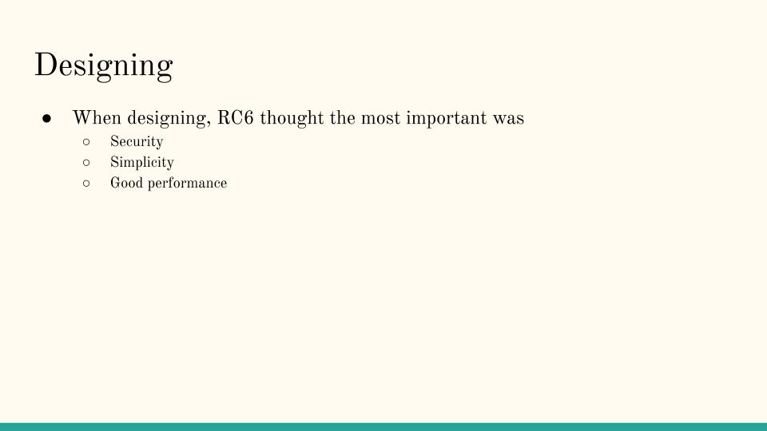

# RC6

### How to use
1. open terminal 
2. cd into RC6 directory
3. type `python secure.py -key (your key e.g "securekey") -encrypt (phrase e.g hello world)`
4. will output encryption.txt file which can be used to encrypt using the same key
5. type `python secure.py -key (your key) -decrypt`

 

### What is RC6?
To better understand RC6, we should dive a little into its predecessor, RC5.

During the late 1990's National Institute of Standards and Technology wanted to find a 
successor to its Data Encryption Standard (DES). So they
held a competition 

### Implementation

